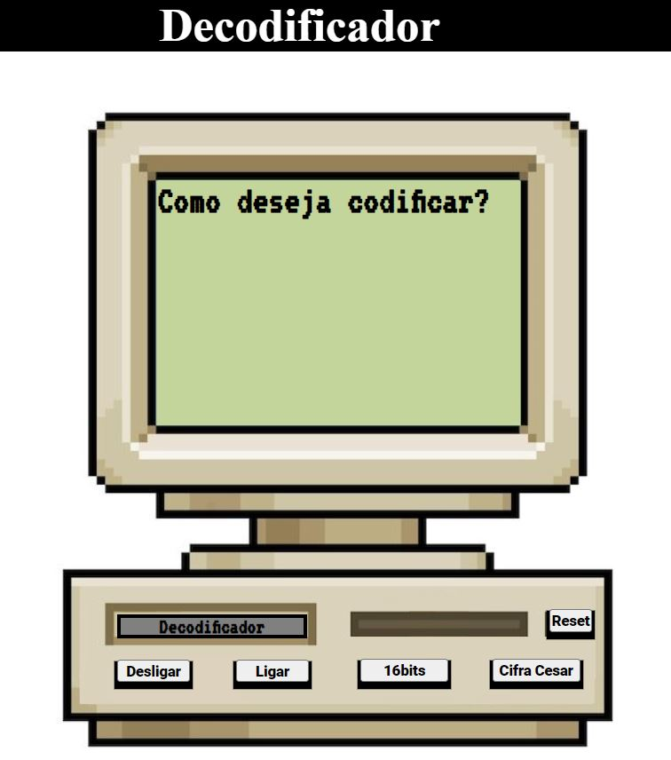
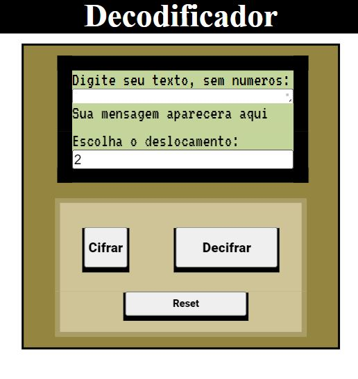

<h1 align="center">Resilia</h1>
<h2 align="center">Codificador e Decodificador, utilizando 64bits e Cifra de Cesar</h2>

Oprojeto tem como intuito, codificar e decodificar utilizando dois metodos de 64its e cifra de cesar
Este projeto fou utilizado dois leyout.

Para tela acima de 600pix, foi utilizado o Leyout abaixo que consiste em unificar todos o nosso aprendizado até hoje:

Na primeira tela foi utiliza dois botões "Desligar" e "Ligar", este dois botões com o auxilio do jquery utila um comando:
$(document).ready(function(){$(".on2").click(functi({$(".caixatexto").css("visibility","visible");});});
Utiliza o evento de de click o hidden e o visible intruções do CSS que permite que enchergamos ou não um display de forma que ele continue preservando seu espaço, assim mantemos o leyout da pagina não é afetada.

ao utilizar o mesmo evento de click, nos botões de 64bits ou de cifra de cesar, alteraão o display do leyout inicia para none, e atribiu para o display seleciona um atributo que permiti a visualizaçãpodando o efeito de troca de tela.

o Botão reset carrega a pagina e permite que retornamos a configuração inicial mostrando a tela de inicio.

🛠️ Para utilizar responsivida foi utilizado o @midia
dentro desses parametros foi feito a anulação da imagem de fundo, anulados alguns botões para otimizar o espaço da tela, e foi criado um novo Leyout, utilizando CSS.

Este trabalho teve como intuito reaproveitamento de codigos de outras pessoas  para executar a 
coodificação de 64Bits, foi utilizado como fonte o projeto abaixo:

https://github.com/Fefeprogrammer/Criptografia

Para o Cifra de cesar foi utilizado como base o projeto abaixo:

https://github.com/juliabb/SAP007-cipher

Apesar da utilização do projeto como base foi feito 
toda uma adaptação ao projeto e documentado todo o intendimento de sua funcionalidade, tudo o que foi reutilizado nesse trabalho esta comentado e descrito qual foi o objetivo da esrutura de codigo.

Chego nesta etapa bem satisfeito com o que foi feito 
e com a sensação de que estou evoluindo cada dia mais.